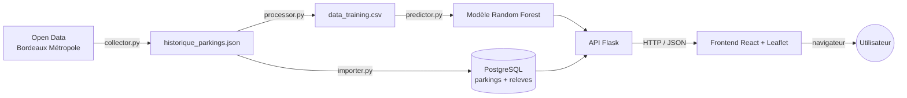

# IA Mobility

Application web qui **estime le taux d'occupation des parkings de Bordeaux** à
partir de l'heure et du jour, pour aider un utilisateur à anticiper ses chances
de stationnement. L'estimation repose sur un modèle d'apprentissage automatique
(Random Forest) alimenté par les données ouvertes de Bordeaux Métropole.

Ce dépôt est le support de la soutenance du titre professionnel **Développeur en
Intelligence Artificielle** (RNCP37827), blocs 1 à 3 (épreuves E1, E3, E4, E5).

## Fonctionnalités

- Carte interactive des parkings de Bordeaux (un marqueur par parking).
- Prédiction d'occupation au clic sur un parking, avec mode dégradé si le
  service de prédiction est indisponible.
- Panneau latéral trié par occupation croissante (« où me garer maintenant ? »).
- Recherche de parking et sélecteur heure/jour pour simuler un autre moment.
- API REST : prédiction, référentiel des parkings, historique, export du jeu
  d'entraînement, santé et métriques de monitorage.

## Architecture



Trois services, orchestrés par Docker Compose :

| Service | Rôle | Technologie |
|---|---|---|
| `db` | Stockage du référentiel et de l'historique | PostgreSQL |
| `ai-service` | API de prédiction et de mise à disposition des données | Python, Flask, scikit-learn |
| `frontend` | Interface cartographique | React, Vite, TypeScript, Leaflet |

## Structure du dépôt

```
IA_Mobility/
├── apps/
│   ├── ai-service/            # Service Python (API + IA + données)
│   │   ├── main.py            # API Flask (endpoints)
│   │   ├── src/
│   │   │   ├── collector.py   # Collecte Open Data (option --loop)
│   │   │   ├── processor.py   # Nettoyage -> data_training.csv
│   │   │   ├── predictor.py   # Entraînement du modèle
│   │   │   ├── importer.py    # Import JSON -> PostgreSQL (idempotent)
│   │   │   ├── db.py          # Connexion PostgreSQL
│   │   │   └── logging_config.py
│   │   ├── tests/             # Tests pytest
│   │   ├── data/              # Données brutes et jeu d'entraînement
│   │   ├── models/            # Modèle et encodeur entraînés (.pkl)
│   │   └── Dockerfile
│   └── frontend/              # Interface React + Leaflet
│       ├── src/
│       └── Dockerfile
├── db/schema.sql             # Schéma PostgreSQL (joué au 1er démarrage)
├── docker-compose.yml        # Orchestration base + API + frontend
├── docs/
│   ├── bdd.md                # Modèle de données et RGPD
│   ├── incident.md           # Fiche d'incident (E5)
│   └── rapports/             # Rapports professionnels E1/E3/E4/E5
└── .github/workflows/ci.yml  # Intégration continue
```

## Prérequis

- **Docker Desktop** (avec WSL 2 sous Windows) pour le lancement complet.
- Pour le développement hors Docker : **Python 3.11+** et **Node.js 20.19+ / 22.12+**.

## Installation et lancement (Docker)

```bash
# 1. Copier le modèle de configuration et l'adapter si besoin.
cp .env.example .env

# 2. Construire et lancer les trois services.
docker compose up --build
```

Puis ouvrir **http://localhost:3000**.

| Service | URL |
|---|---|
| Frontend | http://localhost:3000 |
| API | http://localhost:5000 |
| Base PostgreSQL | localhost:5433 |

> Le service `ai-service` importe automatiquement les données dans PostgreSQL au
> démarrage (opération idempotente), puis expose l'API.

Pour arrêter : `docker compose down` (ajouter `-v` pour supprimer aussi les données).

## Lancement sans Docker (développement)

**Service IA :**

```bash
cd apps/ai-service
pip install -r requirements.txt
python main.py            # API sur http://localhost:5000
```

**Frontend :**

```bash
npm install
npm run dev -w @ia-mobility/frontend   # http://localhost:5173
```

Les endpoints de données (`/parkings`, `/historique`) nécessitent une base
PostgreSQL accessible (voir `.env`) ; `/predict` et `/health` fonctionnent sans base.

## Tests

**Service IA (lint + tests unitaires et d'API) :**

```bash
cd apps/ai-service
pip install -r requirements.txt -r requirements-dev.txt
ruff check .
pytest
```

**Frontend (build) :**

```bash
npm ci
npm run build -w @ia-mobility/frontend
```

Ces mêmes étapes sont exécutées automatiquement par l'intégration continue
(`.github/workflows/ci.yml`) à chaque push et pull request.

## Endpoints de l'API

| Méthode | Endpoint | Description |
|---|---|---|
| GET | `/health` | État du service (modèle chargé) |
| GET | `/metrics` | Indicateurs de monitorage (requêtes, taux d'erreur, temps moyen) |
| GET | `/predict?nom=...` | Prédiction d'occupation. Paramètres optionnels : `heure`, `jour`, `minute` |
| GET | `/parkings` | Référentiel des parkings (nom, coordonnées, capacité) |
| GET | `/parkings/<nom>/historique` | Historique horodaté, paginé (`page`, `limite`) |
| GET | `/dataset` | Export du jeu d'entraînement (`format=csv` ou `json`) |

## Collecte des données

La donnée d'occupation évolue en permanence : la collecte doit tourner **en
continu** pour constituer l'historique. Une capture est enregistrée **toutes les
2 minutes**.

### Lancer la collecte

Avec Docker (recommandé, redémarre automatiquement) :

```bash
docker compose up -d collector
```

Sans Docker :

```bash
cd apps/ai-service
nohup python src/collector.py --loop --intervalle 120 &
```

> Important : la collecte doit tourner sur une machine qui reste allumée.

### Chaîne de rafraîchissement

Après quelques jours de collecte, régénérer les données, le modèle et l'évaluation :

```bash
cd apps/ai-service
python src/processor.py     # 1. historique brut  -> data_training.csv
python src/importer.py      # 2. historique brut  -> PostgreSQL
python src/predictor.py     # 3. entraînement du modèle de production
python -m src.evaluator     # 4. évaluation (MAE, baselines, jeu de test figé)
```

## Documentation

- [docs/bdd.md](docs/bdd.md) — modèle de données, choix de conception, RGPD.
- [docs/incident.md](docs/incident.md) — fiche d'incident (épreuve E5).
- [docs/rapports/](docs/rapports/) — rapports professionnels E1, E3, E4, E5.
