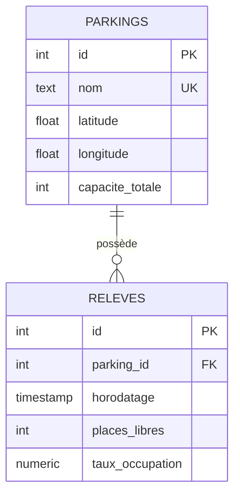
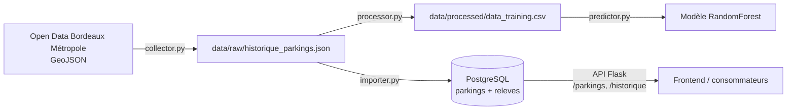

# Base de données — IA Mobility (Bloc 1 / E1)

Ce document décrit le stockage des données de parkings : le modèle de données,
les choix de conception et la prise en compte du RGPD. Il complète les scripts
`collector.py` (collecte), `processor.py` (nettoyage) et `importer.py` (chargement en base).

## 1. Modèle conceptuel



Un **parking** possède plusieurs **relevés** ; chaque relevé appartient à un seul
parking (relation 1—N).

## 2. Les deux tables

### `parkings` — le référentiel
Une ligne par parking, pour les informations **stables** dans le temps :

| Colonne | Type | Rôle |
|---|---|---|
| `id` | SERIAL, PK | identifiant technique |
| `nom` | TEXT, UNIQUE, NOT NULL | clé métier (sert à retrouver un parking) |
| `latitude`, `longitude` | DOUBLE PRECISION | position pour la carte Leaflet |
| `capacite_totale` | INTEGER, `>= 0` | nombre total de places |

### `releves` — l'historique
Une ligne par capture d'occupation, pour les informations qui **changent** :

| Colonne | Type | Rôle |
|---|---|---|
| `id` | SERIAL, PK | identifiant technique |
| `parking_id` | INTEGER, FK → parkings | rattache le relevé à son parking |
| `horodatage` | TIMESTAMP, NOT NULL | moment de la capture |
| `places_libres` | INTEGER, `>= 0` | places disponibles à cet instant |
| `taux_occupation` | NUMERIC(5,2), `0–100` | occupation en % (variable à prédire) |

## 3. Justification des choix

- **Deux tables plutôt qu'une seule.** L'identité d'un parking (nom, position,
  capacité) ne change pas, alors que son occupation évolue en permanence. Séparer
  le référentiel de l'historique évite de répéter le nom et les coordonnées à
  chaque relevé : c'est le principe d'une base relationnelle normalisée.
- **`nom` en clé unique.** La source Open Data n'a pas d'identifiant technique
  stable exploitable côté métier ; le nom sert donc de clé métier et garantit
  qu'un parking n'est pas dupliqué. C'est aussi ce que le frontend et l'API
  `/predict` utilisent pour désigner un parking.
- **Contrainte `UNIQUE (parking_id, horodatage)`.** Un parking ne peut avoir
  qu'un seul relevé pour un horodatage donné. Cette contrainte rend l'import
  **idempotent** : rejouer `importer.py` n'ajoute aucun doublon.
- **Contraintes `CHECK`.** `capacite_totale >= 0`, `places_libres >= 0` et
  `taux_occupation` borné à `0–100` : la base refuse une donnée aberrante à la
  source, avant même le modèle.
- **Index.** `idx_releves_parking_id` accélère « tous les relevés d'un parking »
  (endpoint `/parkings/<nom>/historique`) ; `idx_releves_horodatage` accélère les
  filtres par plage de dates.

## 4. Requête d'extraction (exemple, compétence C2)

Extraire l'historique d'occupation d'un parking, prêt pour un jeu d'entraînement ciblé :

```sql
SELECT p.nom, r.taux_occupation, r.horodatage
FROM releves r
JOIN parkings p ON p.id = r.parking_id
WHERE p.nom = 'Clemenceau'
ORDER BY r.horodatage;
```

## 5. Chaîne de données



## 6. RGPD

Les données manipulées sont des **données publiques d'occupation de parkings**
issues de l'Open Data de Bordeaux Métropole : nom du parking, position
géographique, nombre de places, horodatage de la mesure. **Aucune donnée à
caractère personnel** n'est collectée ni stockée (pas d'identité, pas de plaque,
pas de trajet d'utilisateur). Le RGPD n'impose donc pas de contrainte directe sur
ce jeu de données.

Par souci de traçabilité, on documente néanmoins :
- **la provenance** : API GeoJSON publique de Bordeaux Métropole ;
- **la nature** : occupation de parkings, sans caractère personnel ;
- **la finalité** : entraîner un modèle d'estimation de l'occupation.

La clé d'accès à l'API est désormais lue depuis une variable d'environnement
(`BORDEAUX_API_KEY`) et non plus écrite en dur dans le code.
